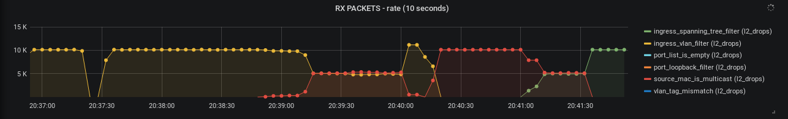

Devlink exporter
================

Since version 5.4 the Linux kernel exposes information about hardware
originated packet drops and exceptions via the [`devlink-trap`][1]
interface.

Using `devlink-exporter` it is possible to export packets and bytes
statistics about each packet trap to Prometheus.

The tool is inspired by [`prometheus-ethtool-exporter`][2].

Usage
-----

```
usage: devlink-exporter.py [-h] (-f TEXTFILE_NAME | -l LISTEN) [-i INTERVAL]
                           [-1]

optional arguments:
  -h, --help            show this help message and exit
  -f TEXTFILE_NAME, --textfile-name TEXTFILE_NAME
                        Full file path where to store data for node collector
                        to pick up
  -l LISTEN, --listen LISTEN
                        Listen host:port, i.e. 0.0.0.0:9417
  -i INTERVAL, --interval INTERVAL
                        Number of seconds between updates of the textfile.
                        Default is 5 seconds
  -1, --oneshot         Run only once and exit. Useful for running in a
                        cronjob
```

The exporter can be started automatically using a `systemd` service unit
file. For example:

```
# /etc/systemd/system/devlink-exporter.service
[Unit]
Description=devlink exporter
Documentation=man:devlink(8)
After=network.target

[Service]
Type=simple
ExecStart=/usr/local/bin/devlink-exporter.py -l 0.0.0.0:9417

[Install]
WantedBy=multi-user.target
```

To start the service, run:

```
$ systemctl start devlink-exporter
```

To make the configuration persistent, run:

```
$ systemctl enable devlink-exporter.service
```

When scraped by the Prometheus server, the exporter will query the
statistics from the kernel and pass them over HTTP to the server.

[Grafana][3] can then be used to visualize the information:



[1]: https://www.kernel.org/doc/html/latest/networking/devlink-trap.html
[2]: https://github.com/Showmax/prometheus-ethtool-exporter
[3]: https://grafana.com/
