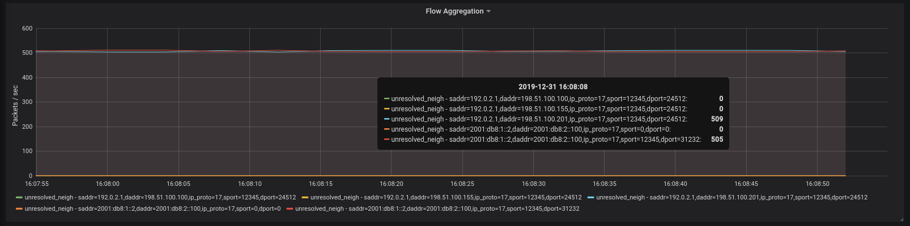

Aggregated statistics using eBPF
================================

`devlink-exporter` exports packets and bytes statistics for each packet
trap. In case per-{flow, trap} information is required, it is possible
to use [`ebpf_exporter`][1] with the [trapagg.yaml](trapagg.yaml)
configuration file.

Usage
-----

After [installing `ebpf_exporter`][2], run:

```
$ ebpf_exporter --debug --config.file=trapagg.yaml
```

It will export metrics such as the below to Prometheus:

```
# HELP ebpf_exporter_flow_trap_packets Per-{flow, trap} statistics
# TYPE ebpf_exporter_flow_trap_packets counter
ebpf_exporter_flow_trap_packets{addr_proto="ipv4",daddrv4="198.51.100.10",daddrv6="::",dport="34512",ip_proto="17",is_encap="0",saddrv4="192.0.2.1",saddrv6="::",sport="12345",trap="unresolved_neigh"} 10
ebpf_exporter_flow_trap_packets{addr_proto="ipv4",daddrv4="198.51.100.11",daddrv6="::",dport="34512",ip_proto="17",is_encap="0",saddrv4="192.0.2.1",saddrv6="::",sport="12345",trap="unresolved_neigh"} 9
ebpf_exporter_flow_trap_packets{addr_proto="ipv4",daddrv4="198.51.100.12",daddrv6="::",dport="34512",ip_proto="17",is_encap="0",saddrv4="192.0.2.1",saddrv6="::",sport="12345",trap="unresolved_neigh"} 9
ebpf_exporter_flow_trap_packets{addr_proto="ipv4",daddrv4="198.51.100.13",daddrv6="::",dport="34512",ip_proto="17",is_encap="0",saddrv4="192.0.2.1",saddrv6="::",sport="12345",trap="unresolved_neigh"} 9
ebpf_exporter_flow_trap_packets{addr_proto="ipv4",daddrv4="198.51.100.14",daddrv6="::",dport="34512",ip_proto="17",is_encap="0",saddrv4="192.0.2.1",saddrv6="::",sport="12345",trap="unresolved_neigh"} 9
ebpf_exporter_flow_trap_packets{addr_proto="ipv4",daddrv4="198.51.100.15",daddrv6="::",dport="34512",ip_proto="17",is_encap="0",saddrv4="192.0.2.1",saddrv6="::",sport="12345",trap="unresolved_neigh"} 9
```

[Grafana][3] can then be used to visualize the information:



Details
-------

The per-{flow, trap} information is obtained by attaching an eBPF
program to a [kprobe][4] in the kernel. The program dissects incoming
packets and stores number of packets received in a LRU hash table keyed
by flow information and trap reason. The contents of the hash table are
then formatted by the `ebpf_exporter` and exported to Prometheus.

By default, the size of the LRU hash table is 1,024 entries. In case the
table overflows, it will be flushed. It is possible to change the size
of the hash table by modifying the configuration file.

With kernel 5.10 and above it is possible to use `trapagg_tp.yaml`
instead of `trapagg.yaml`. It attaches an eBPF program to the
`devlink_trap_report` raw tracepoint, which should provide a more stable
interface and better performance compared to the previously mentioned
kprobe.

[1]: https://github.com/cloudflare/ebpf_exporter
[2]: https://github.com/cloudflare/ebpf_exporter#building-and-running
[3]: https://grafana.com/
[4]: https://www.kernel.org/doc/Documentation/kprobes.txt
